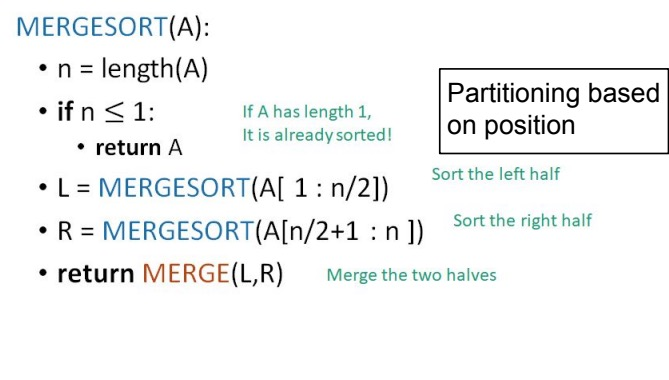
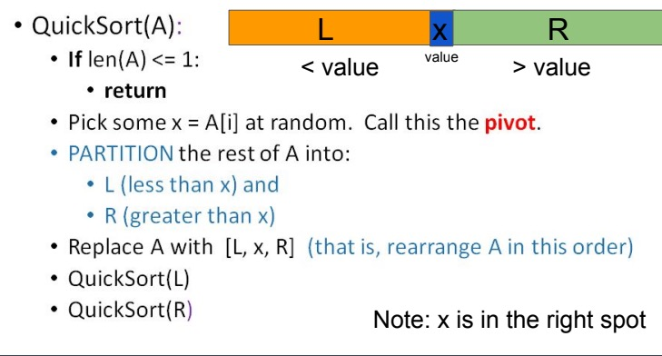
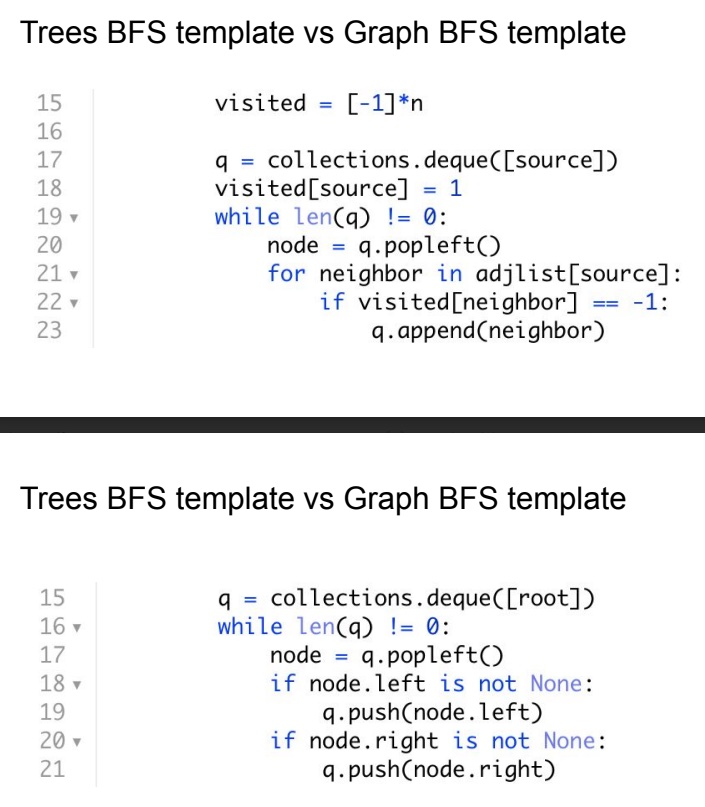
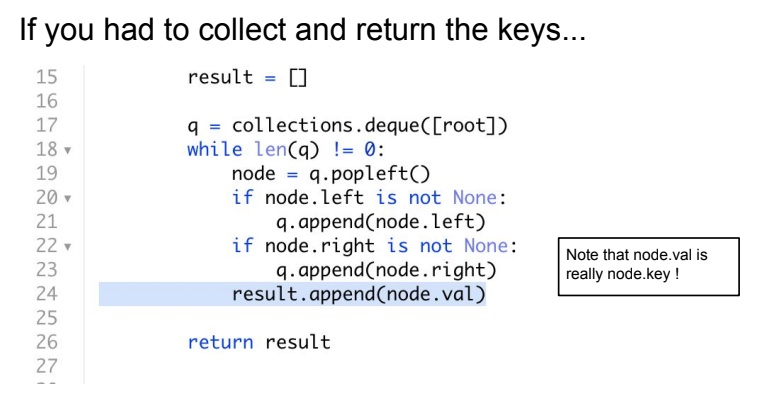
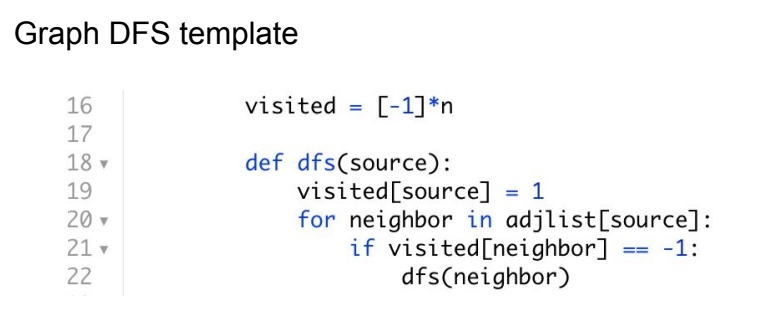
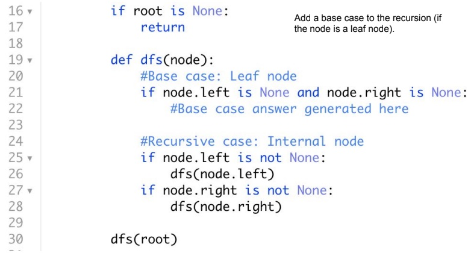

# Sorting


## Merge Sort



```
step 1: start

step 2: declare array and left, right, mid variable

step 3: perform merge function.
    if left > right
        return
    mid= (left+right)/2
    mergesort(array, left, mid)
    mergesort(array, mid+1, right)
    merge(array, left, mid, right)

step 4: Stop
```

## Merge Sort Code {.tabset}

### java 
```java
void merge(int arr[], int l, int m, int r)
    {
        // Find sizes of two subarrays to be merged
        int n1 = m - l + 1;
        int n2 = r - m;
 
        /* Create temp arrays */
        int L[] = new int[n1];
        int R[] = new int[n2];
 
        /*Copy data to temp arrays*/
        for (int i = 0; i < n1; ++i)
            L[i] = arr[l + i];
        for (int j = 0; j < n2; ++j)
            R[j] = arr[m + 1 + j];
 
        /* Merge the temp arrays */
 
        // Initial indexes of first and second subarrays
        int i = 0, j = 0;
 
        // Initial index of merged subarray array
        int k = l;
        while (i < n1 && j < n2) {
            if (L[i] <= R[j]) {
                arr[k] = L[i];
                i++;
            }
            else {
                arr[k] = R[j];
                j++;
            }
            k++;
        }
 
        /* Copy remaining elements of L[] if any */
        while (i < n1) {
            arr[k] = L[i];
            i++;
            k++;
        }
 
        /* Copy remaining elements of R[] if any */
        while (j < n2) {
            arr[k] = R[j];
            j++;
            k++;
        }
    }
 
    // Main function that sorts arr[l..r] using
    // merge()
    void sort(int arr[], int l, int r)
    {
        if (l < r) {
            // Find the middle point
            int m = l + (r - l) / 2;
 
            // Sort first and second halves
            sort(arr, l, m);
            sort(arr, m + 1, r);
 
            // Merge the sorted halves
            merge(arr, l, m, r);
        }
    }
```

### Python

```python 
def mergesort(a):
    msort(a, 0 , len(a)-1)

def msort(l, start, end):
    if start >= end:
        return

    mid = (start + end)/2
    msort(l, start, mid)
    msort(l, mid+1, end)

    i = start
    j = mid+1
    mlist = []

    while i <= mid and j <= end:
        if l[i] <= l[j]:
            mlist.append(l[i])
            i += 1
        elif l[j] < l[i]:
            mlist.append(l[j])
            j += 1
    while i <= mid:
        mlist.append(l[i])
        i += 1
    while j <= end:
        mlist.append(l[j])
        j += 1
    l[start:end+1] = mlist
```

Time Complexity: O(n log n)

## Quick Sort
-------------



```java
static void quickSort(int[] arr, int low, int high)
    {
        if (low < high) {
 
            // pi is partitioning index, arr[p]
            // is now at right place
            int pi = partition(arr, low, high);
 
            // Separately sort elements before
            // partition and after partition
            quickSort(arr, low, pi - 1);
            quickSort(arr, pi + 1, high);
        }
    }
static int partition(int[] arr, int low, int high)
    {
        // Choosing the pivot
        int pivot = arr[high];
 
        // Index of smaller element and indicates
        // the right position of pivot found so far
        int i = (low - 1);
 
        for (int j = low; j <= high - 1; j++) {
 
            // If current element is smaller than the pivot
            if (arr[j] < pivot) {
 
                // Increment index of smaller element
                i++;
                swap(arr, i, j);
            }
        }
        swap(arr, i + 1, high);
        return (i + 1);
    }

```
## Merge sort vs Quick sort

* Merge Sort is O(n log n) for best, average and worst case
* Quick Sort is O(n log n) for best & average case, but O(n2) worst-case

* Quick Sort runs faster in empirical analysis.
* Quick Sort is also in-place, which Merge Sort is not.
* Merge Sort is stable, Quick Sort is not.

## Heap Sort

```java
public void sort(int arr[])
    {
        int n = arr.length;
 
        // Build heap (rearrange array)
        for (int i = n / 2 - 1; i >= 0; i--)
            heapify(arr, n, i);
 
        // One by one extract an element from heap
        for (int i = n - 1; i >= 0; i--) {
            // Move current root to end
            int temp = arr[0];
            arr[0] = arr[i];
            arr[i] = temp;
 
            // call max heapify on the reduced heap
            heapify(arr, i, 0);
        }
    }
 
    // To heapify a subtree rooted with node i which is
    // an index in arr[]. n is size of heap
    void heapify(int arr[], int n, int i)
    {
        int largest = i; // Initialize largest as root
        int l = 2 * i + 1; // left = 2*i + 1
        int r = 2 * i + 2; // right = 2*i + 2
 
        // If left child is larger than root
        if (l < n && arr[l] > arr[largest])
            largest = l;
 
        // If right child is larger than largest so far
        if (r < n && arr[r] > arr[largest])
            largest = r;
 
        // If largest is not root
        if (largest != i) {
            int swap = arr[i];
            arr[i] = arr[largest];
            arr[largest] = swap;
 
            // Recursively heapify the affected sub-tree
            heapify(arr, n, largest);
        }
    }
 
    /* A utility function to print array of size n */
    static void printArray(int arr[])
    {
        int n = arr.length;
        for (int i = 0; i < n; ++i)
            System.out.print(arr[i] + " ");
        System.out.println();
    }
 
    // Driver program
    public static void main(String args[])
    {
        int arr[] = { 12, 11, 13, 5, 6, 7 };
        int n = arr.length;
 
        HeapSort ob = new HeapSort();
        ob.sort(arr);
 
        System.out.println("Sorted array is");
        printArray(arr);
    }
}

```

# Recursion

### Generate All Subsets Of A Set

```java
static ArrayList<String> generate_all_subsets(String s) {
        ArrayList<String> result = new ArrayList<String>();
        helper(s, "", 0, result);
        return result;
    }
    
    static void helper(String s, String slate, int start, ArrayList<String> result){
        //Base case
        if (start == s.length()){
            result.add(slate);
            return;
        }
        
        helper(s, slate, start+1, result);
        helper(s, slate+s.substring(start, start+1), start+1, result);
    }
```

### Palindromic Decomposition Of A String

```java
static ArrayList<String> generate_palindromic_decompositions(String s) {
        
        ArrayList<String> result = new ArrayList<String>();
        helper(s, new StringBuilder(s.substring(0,1)), s.substring(0,1), 1, result);
        return result;
    }
    
    static void helper(String s, StringBuilder slate, String lastString, int start, ArrayList<String> result){
        
        if (start == s.length()){
             if (isPalindrom(lastString)) {
                result.add(slate.toString());
            }
            return;
        }
        helper(s, slate.append(s.substring(start,start+1)), lastString + s.substring(start,start+1), start+1, result);
        
        slate.deleteCharAt(slate.length()-1);
        
        if (!isPalindrom(lastString))
            return;
        helper(s, slate.append("|").append(s.substring(start,start+1)), s.substring(start,start+1), start+1, result);
        slate.deleteCharAt(slate.length()-1);
        slate.deleteCharAt(slate.length()-1);

    }
    
    static boolean isPalindrom(String s){
        StringBuilder plain = new StringBuilder(s);
        StringBuilder reverse = plain.reverse();
        return (reverse.toString()).equals(s);
    }

```

## Trees BFS template vs Graph BFS template






## DFS

### Graph DFS



### Tree DFS
